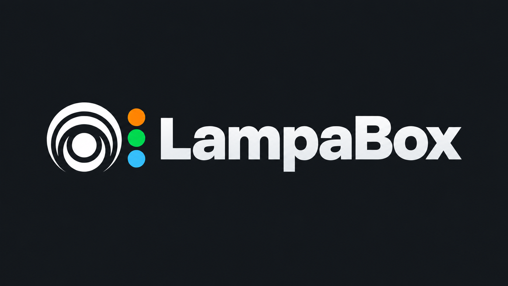

<p align="center">
  
</p>

Плагин для Lampa 3.0+, который добавляет публичные коллекции Letterboxd в интерфейс Lampa и сопоставляет фильмы и сериалы с TMDB.

## Demo


## Возможности

- отдельный раздел `Letterboxd` в боковом меню Lampa;
- публичный Watchlist пользователя;
- подключение нескольких публичных Letterboxd Lists;
- быстрый импорт популярных Lists из обновляемого каталога;
- каталог просмотренных фильмов Letterboxd;
- поддержка фильмов и сериалов через TMDB Movie/TV Search;
- фильтры `Все`, `Просмотрено` и `Не просмотрено`;
- плашки `Letterboxd ✓` и `Lampa ✓` на карточках;
- сохранение плашек в строках, полном каталоге и на странице фильма;
- прогрессивное появление карточек во время TMDB-сопоставления;
- фоновое накопление просмотренных фильмов в Cloudflare KV;
- retry, exponential backoff и jitter для временных ошибок Letterboxd/TMDB.

## Установка

Добавьте URL в список плагинов Lampa:

[Подключить LampaBox 1.4.0](https://lampa-letterboxd-watchlist.lampabox.workers.dev/letterboxd-watchlist.js?v=1.4.0)

```text
https://lampa-letterboxd-watchlist.lampabox.workers.dev/letterboxd-watchlist.js?v=1.4.0
```

Затем:

1. Полностью перезапустите Lampa.
2. Откройте `Настройки → Letterboxd`.
3. Укажите **публичный** Letterboxd username.
4. При необходимости выберите готовые подборки через `Популярные Letterboxd Lists` или добавьте свои публичные списки.
5. Откройте пункт `Letterboxd` в боковом меню.

Плагин и API обслуживаются одним Cloudflare Worker. Отдельный сервер, VPS, Docker-контейнер или постоянно работающий компьютер не нужны.

## Настройка публичных списков

Кнопка `Популярные Letterboxd Lists` открывает проверенный каталог. Выбор добавляет список, повторный выбор удаляет его. Каталог обновляется через KV существующего Worker, а при временной недоступности `/presets` используется встроенная копия.

Поле `Public lists` принимает значения через запятую или с новой строки:

```text
my-favorites
other-user/tv-picks
https://letterboxd.com/official/list/letterboxds-top-500-films/
```

Поддерживаемые форматы:

- `slug` — список текущего пользователя;
- `owner/slug`;
- `owner/list/slug`;
- полный URL публичного списка Letterboxd.

Пустые и повторяющиеся значения игнорируются. Закрытые профили, Watchlist и Lists получить невозможно.

## Как работает плагин

```text
Letterboxd HTML
      ↓
Cloudflare Worker ── Cloudflare KV
      ↓
Lampa plugin
      ↓
TMDB Movie / TV Search
```
